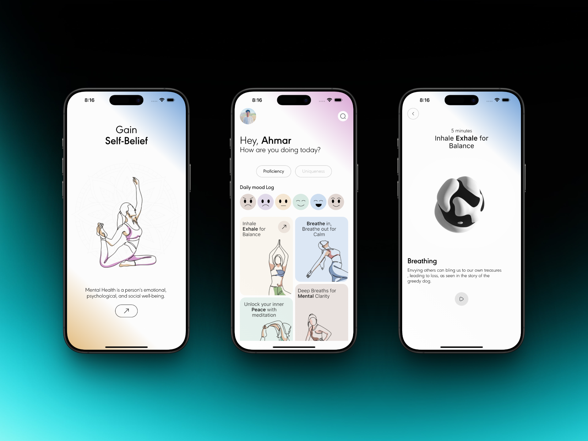

# Mental Health App UI 🧘‍♂️✨

A **modern and clean UI design** for a Mental Health App built with **Flutter**.  
This project focuses on **aesthetic design, smooth animations, and clean code**, providing a strong foundation for anyone looking to create a mental health or wellness app.

---

## ✨ Features

- 🎨 **Modern UI Design** – Clean, minimalistic, and user-friendly interface.  
- ⚡ **Smooth Animations** – Subtle and modern animations for a polished experience.  
- 📱 **Responsive Layouts** – Works well on different screen sizes.  
- 🧩 **Reusable Widgets** – Well-structured and modular code for easy customization.  
- 📝 **Reference for Developers** – Ideal for those learning how to build mental health or wellness apps with Flutter.  

---

## ✨ Screenshots

<p align="center">
  
</p>


## 🚀 Getting Started

### 1. Clone the repository
```bash
git clone https://github.com/codexahmar/ai_mental_health

